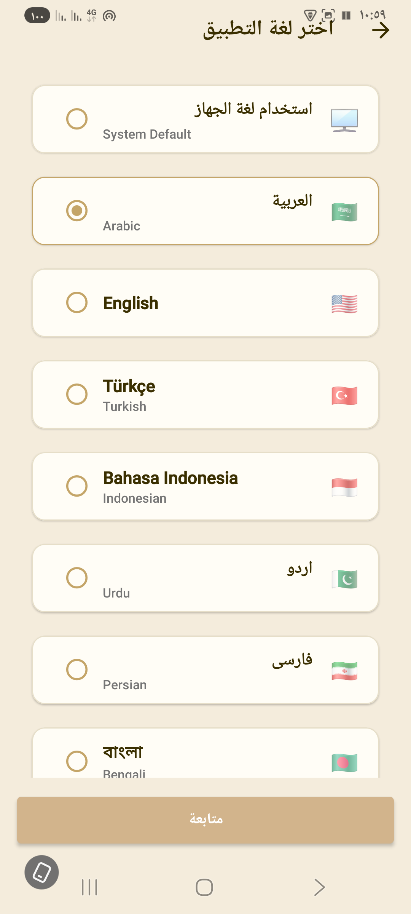
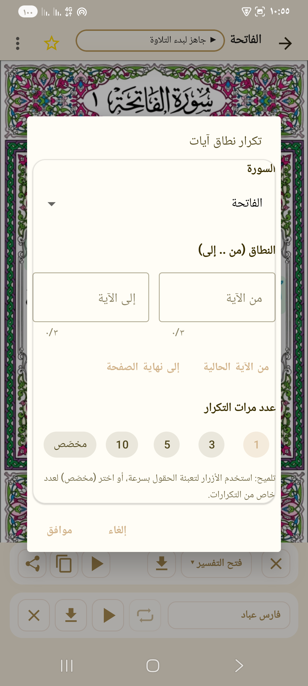
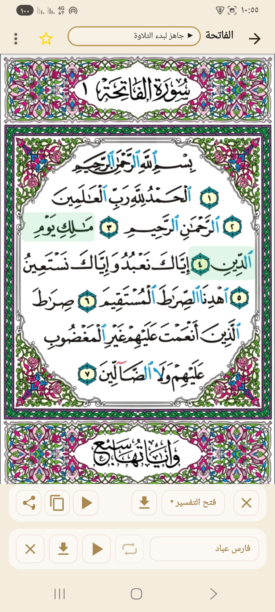

# 📖 تطبيق القرآن الكريم

تطبيق القرآن الكريم (Holy Quran) هو تطبيق مفتوح المصدر لعرض المصحف الشريف كاملًا مع العديد من الخصائص الحديثة.

---

## ✨ المميزات

- 📑 **عرض سور وأجزاء القرآن الكريم** بشكل منظم.
- 🎧 **الاستماع للتلاوات** من عدة قرّاء (السديس، الشريم، المعيقلي، فارس عباد، العجمي، وغيرهم).
- 🔄 **التكرار** مع إمكانية تحديد عدد مرات التكرار للآية.
- 🌍 **تعدد اللغات** (العربية، الإنجليزية، التركية، الإندونيسية، الفارسية، الألمانية، الفرنسية، الإسبانية، الإيطالية، البرتغالية، الروسية...).
- 📖 **التفسير**: عرض تفسير الآيات مع إمكانية المشاركة.
- ⭐ **المفضلة**: حفظ الصفحات أو السور المفضلة للوصول السريع.
- 🎨 **واجهة عصرية** مع دعم الوضع الليلي.

---## 📸 صور من التطبيق

### 🔹 الواجهة الرئيسية


### 🔹 قائمة السور


### 🔹 اختيار القارئ


### 🔹 اختيار اللغة


### 🔹 التفسير


### 🔹 إعدادات التكرار


### 🔹 صفحة الفاتحة


### 🔹 عرض آيات مع التظليل

---

## 📦 التنصيب والبناء

1. استنسخ المشروع:

```bash
git clone https://github.com/afagamro/QuranKarim.git
